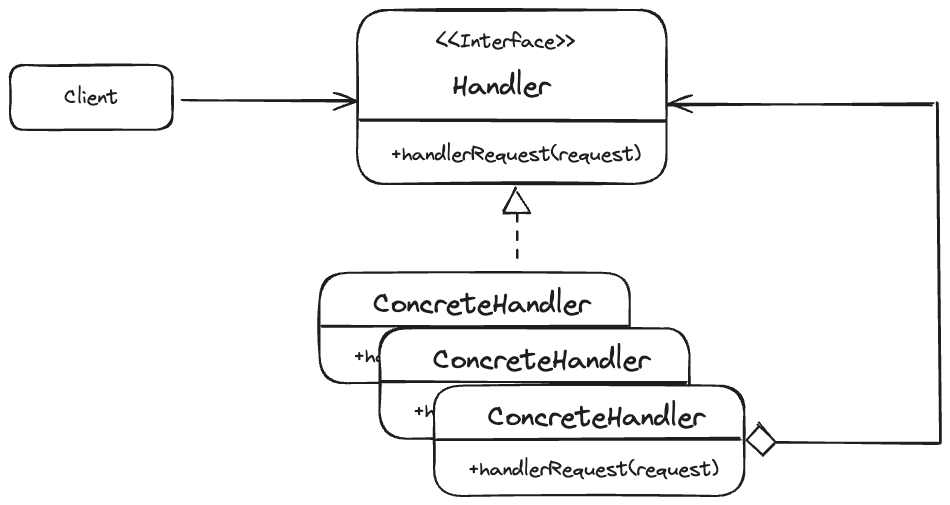
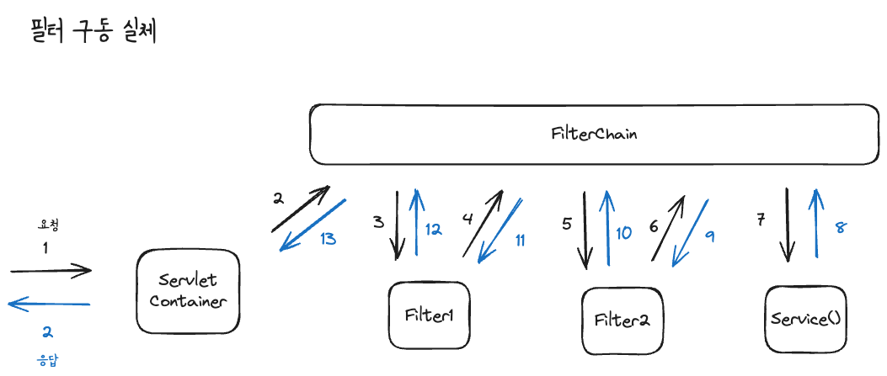

# 책임 연쇄 패턴(Chain of Responsibility)
---
책임 연쇄 패턴은 요청을 보내는 쪽(sender)과 요청을 처리하는 쪽(receiver)를 분리하는 패턴이다. 즉 클라이언트의 요청에 대한 처리를 하나의 객체가 전부 처리하는 것이 아닌, 여러개의 처리 객체들로 나누고 이들을 사슬(chain)처럼 연결해 연쇄적으로 처리하는 행동패턴이다. 

이때 요청을 처리하는 객체들을 핸들러(handler)라고 부르며, 각 핸들러는 요청을 받으면 요청을 처리할 지 아니면 체인의 다음 핸들러로 전달할지 결정하는 역할을 한다. 

책임 연쇄 패턴은 요청을 보내는 쪽에서 그 요청을 처리하는 핸들러가 어떤 구체적인 타입인지 알 필요 없이 `Decoupling`된 상태로 요청을 처리하도록 보낼 수 있다.

## 구조


- Client
  - 요청을 보내는 객체
- Handler
  - 요청을 수신하고 처리 객체들의 집합을 정의하는 인터페이스
- ConcreteHandler
  - 요청을 처리하는 실제 처리 객체
  - 메서드를 통해 다음 핸들러를 체인시킨다.

## 패턴 적용 전
```java
public class Client {

  public static void main(String[] args) {
    Request request = new Request("무궁화 꽃이 피었습니다.");
    RequestHandler requestHandler = new RequestHandler();
    requestHandler.handler(request);
  }
}
```
위 코드를 보면 Client 클래스가 Request 인스턴스를 생성해서 RequestHandler의 handler 메서드의 인자값으로 요청을 보낸다. 

```java
public class RequestHandler {

  public void handler(Request request) {
    System.out.println(request.getBody());
  }
}
```
그리고 RequestHandler를 Request를 받아 body를 출력하도록 한다. 

이때 만약 body를 출력하기 전에 권한 인증 기능을 추가하는 상황이 온다면, 일반적으로는 다음과 같은 방법들을 사용할 수 있다.

- handler 메서드에 추가한다.
- RequestHandler를 상속받는 클래스를 생성한다.

아래는 해당 방법들의 예시 코드이다.

### handler 메서드에 기능을 추가하는 방법
```java
public class RequestHandler {

  public void handler(Request request) {
    // 편의상 출력으로 기능을 대체
    System.out.println("권한 인증");

    System.out.println(request.getBody());
  }
}
```
위 방법의 한계는 SOLID의 단일 책임 원칙을 위배한다는 것이다. body를 출력하는 책임 외에 인증의 책임까지 생겼기 때문이다.

### 상속받아 처리하는 방법
```java
public class AuthRequestHandler extends RequestHandler {

  public void handler(Request request) {
    System.out.println("권한 인증")
    super.handler(request);
  }
}
```
다음 방법은 상속받아 권한 인증을 처리하고 부모클래스의 메서드를 호출하여 body를 출력하는 코드이다. 이 방법의 경우 단일 책임 원칙을 준수하는 코드이다. 

단 이 방법의 문제점은 Client에서 발생한다. 
```java
public class Client {

  public static void main(String[] args) {
    Request request = new Request("무궁화 꽃이 피었습니다.");
    RequestHandler requestHandler = new AuthRequestHandler();
    requestHandler.handler(request);
  }
}
```
사용자가 권한 인증까지 하고 싶으면 AuthRequestHandler를 알아야 한다. 결국 클라이언트가 어떤 Handler를 써야 할 지 결정해야 하는 문제가 발생한다. 

나아가 로깅 기능을 또 추가한다고 하면? 비슷한 방식으로 추가했을 때 본문이 2번 출력되는 것을 방지하기 위해 코드를 변경시켜야 한다.

## 패턴 적용 후
```java
public abstract class RequestHandler {

  private RequestHandler nextHandler;

  public RequestHandler(RequestHandler nextHandler) {
    this.nextHandler = nextHandler;
  }

  public void handle(Request request) {
    if (nextHandler != null) {
      nextHandler.handle(request);
    }
  }
}
```
먼저 RequestHandler는 body 출력 역할을 분리하고 ConcreteHandler들을 체인하는 handle 메서드를 가진다. 

각 ConcreteHandler들은 요청을 처리한 후 이 handle 메서드를 호출하여 요청을 다음 객체로 보낸다.

```java
// body를 출력하는 핸들러
public class PrintRequestHandler extends RequestHandler {

  public PrintRequestHandler(RequestHandler nextHandler) {
    super(nextHandler);
  }

  @Override
  public void handle(Request request) {
    System.out.println(request.getBody());
    super.handle(request);
  }
}
```

```java
// 권한 인증을 하는 핸들러
public class AuthRequestHandler extends RequestHandler {

  public AuthRequestHandler(RequestHandler nextHandler) {
    super(nextHandler);
  }

  @Override
  public void handle(Request request) {
    System.out.println("권한 인증");
    super.handle(request);
  }
}
```

```java
// 로깅하는 핸들러
public class LoggingRequestHandler extends RequestHandler {

  public LoggingRequestHandler(RequestHandler nextHandler) {
    super(nextHandler);
  }

  @Override
  public void handle(Request request) {
    System.out.println("로깅");
    super.handle(request);
  }
}
```

Client가 사용할 RequestHandler들을 체인방식으로 생성해주고 doWork()를 호출한다.
```java
public class Client {

  private RequestHandler requestHandler;

  public Client(RequestHandler requestHandler) {
    this.requestHandler = requestHandler;
  }

  public void doWork() {
    Request request = new Request("무궁화 꽃이 피었습니다.");
    requestHandler.handle(request);
  }

  public static void main(String[] args) {
    RequestHandler chain = new AuthRequestHandler(new LoggingRequestHandler(new PrintRequestHandler(null)));

    Client client = new Client(chain);

    client.doWork();
  }
}
```
결론적으로 책임 연쇄 패턴을 사용함으로써 Client는 구체적인 핸들러를 알 필요 없이 doWork()만 호출하면 된다. 


## 장점 및 단점
책임 연쇄 패턴은 각 객체에 독립시키고 상호 결합도를 느슨하게 만들고 중첩 if-else를 최적화하는게 특화되어 실무에서도 많이 사용되는 패턴이다. 

앞의 예제를 통해 알 수 있는 책임 연쇄 패턴의 가장 큰 장점은 유연성과 확장성이다. 새로운 처리 객체를 추가할 때 기존 객체를 수정할 필요 없이 체인에만 연결하면 되고, 상황에 따라 객체의 순서를 변경하거나 제거하는 것도 용이하다. 

단 체인의 구조가 복잡해지면, 시스템의 복잡성 뿐만 아니라, 디버깅/추적이 번거로워질 수 있어 유의해야 한다.

## 자바와 스프링에서 사용되는 책임 연쇄 패턴
자바와 스프링에서도 책임 연쇄 패턴을 사용한 기능을 쉽게 찾아볼 수 있는데 대표적인 것이 바로 자바의 Servlet Filter와 Spring Security의 Config에 사용하는 Chain이다.

### Servlet Filter
필터는 서블릿을 실행하기 전후에 기능을 추가할 때 사용한다. 

아래는 예제 코드이다.
```java
@ServletComponentScan // 서블릿 WebFilter를 스캔해서 빈으로 등록해주는 애노테이션
@SpringBootApplication
public class App {
    
    // 스프링 애플리케이션 진입점, 구동
    public static void main(String[] args) {
        SpringApplication.run(App.class, args);
    }
}
```

```java
@RestController
public class HelloController {
    // "/hello" 엔드포인트를 처리하는 컨트롤러
    @GetMapping("/hello")
    public String hello() {
        return "hello";
    }
}

```

```java
@WebFilter(urlPatterns = "/hello") // hello라는 요청에 필터 적용
public class F1 implements Filter {

  @Override
  public void doFilter(ServletRequest request, ServletResponse response, FilterChain chain) throws IOException, ServletException {
    System.out.println("요청 전 처리1");
    chain.doFilter(request, response);
    System.out.println("요청 후 처리1");
  }
}
```

```java
// F1 필터
@WebFilter(urlPatterns = "/hello")
public class F1 implements Filter {
  @Override
  public void doFilter(ServletRequest request, ServletResponse response, FilterChain chain)
      throws IOException, ServletException {
    System.out.println("F1 - 요청 전 처리");
    chain.doFilter(request, response); // 다음 필터 또는 서블릿으로 요청 전달
    System.out.println("F1 - 요청 후 처리");
  }
}

// F2 필터
@WebFilter(urlPatterns = "/hello")
public class F2 implements Filter {
  @Override
  public void doFilter(ServletRequest request, ServletResponse response, FilterChain chain)
      throws IOException, ServletException {
    System.out.println("F2 - 요청 전 처리");
    chain.doFilter(request, response); // 다음 필터 또는 서블릿으로 요청 전달
    System.out.println("F2 - 요청 후 처리");
  }
}
```
만약 hello 패턴으로 요청이 들어오면 서블릿이 실행되기 전 등록된 필터 순서대로 실행된다.

따라서 위 코드로 hello 요청을 보내면, 필터가 체인되며 그 결과로  
>F2 - 요청 전 처리  
>F1 - 요청 전 처리  
>F1 - 요청 후 처리  
>F2 - 요청 후 처리  
가 출력될 것이다.



### 스프링 시큐리티
스프링 시큐리티의 SecurityConfig에서도 책임 연쇄 패턴이 활용된다.
```java
@Configuration
public class SecurityConfig extends WebSecurityConfigurerAdapter {

  @Override
  protected void configure(HttpSecurity http) throws Exception {
    http.authorizeRequests().anyRequest().permitAll().and();
  }
}
```
configure 메서드의 Expression도 Servlet Filter 그 자체이며 이도 메서드 체인 방식으로 보여지지만 이 또한 책임 연쇄 패턴에 해당한다.

## 정리
요청을 처리하는 객체들의 연결된 체인을 만들어 각각의 객체가 요청을 처리하거나 다음 객체로 전달하는 패턴. 기존 코드를 손대지 않고 기능을 추가하거나 제거할 수 있는 설계 기법이다. 

실무에서 책임 연쇄 패턴을 사용한다면 사용에 대한 주의보다는 순서와 누락에 관한 고려가 필요할 것 같다. 순서에 따라 예상치 못한 오류가 발생할 수도 있고 요청을 처리하지 않을 경우 유실되는 상황이 올 수도 있다. 문제는 체인이 길어질수록 에러가 발생한 객체를 추적하는 것이 어려워진다는 점에 있기 때문이다.

## 참고
>- 코딩으로 학습하는 GoF의 디자인 패턴 - 백기선 강사님  
>- https://refactoring.guru/ko/design-patterns/chain-of-responsibility  
>- https://inpa.tistory.com/entry/GOF-%F0%9F%92%A0-Chain-Of-Responsibility-%ED%8C%A8%ED%84%B4-%EC%99%84%EB%B2%BD-%EB%A7%88%EC%8A%A4%ED%84%B0%ED%95%98%EA%B8%B0


