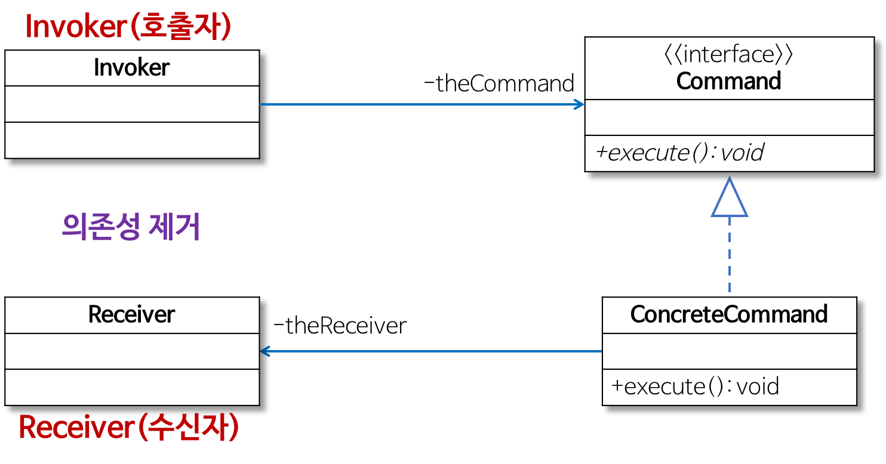

# 커맨드 패턴
<div>

</div>   

*출처: https://refactoring.guru/ko/design-patterns/command*

## 정의
요청을 캡슐화 하여 호출자(invoker)와 수신자(receiver)를 분리하는 패턴이다.
- 요청을 처리하는 방법이 바뀌더라도, 호출자의 코든느 변경되지 않는다.


## 구성요소

<div>

</div> 

- 기능을 캡슐화 함으로써 Invoker(호출자)와 Receiver(수신자)의 의존성을 제거한다.
- 그렇기때문에 Invoker(호출자)를 수정없이 그대로 사용할 수 있도록 해준다.
    - Command
      - 실행될 기능에 대한 인터페이스 
      - execute 메서드로 선언한다.
    - ConcreteCommand
      - 실제로 실행되는 기능을 구현한다.
    - Invoker
      - 실행을 요청하는 호출자 클래스
    - Receiver
      - 요청에 대한 작업을 수행하는 클래스이다.
 
##  커맨드 패턴 적용 전

- 버튼을 누르면 불이 켜진다 여기서 버튼을 눌러 불을 끄게 만들려면 코드를 직접 수정해야한다.

<details>
<summary>코드보기</summary>

## Button
- Invoker ==>> Button
- Receiver ==>> Light
```java
import java.awt.Button;

public class Button {

    private Light light;

    public Button(Light light) {
        this.light = light;
    }

    public void press() {
        light.on();
    }

    public static void main(String[] args) {
        Button button = new Button(new Light());
        button.press();
        button.press();
        button.press();
        button.press();
    }
}
```
</details>

## 문제점 
- 예를 들어 `Button`이 아닌 `App`을 사용하여 불을 끄게 만들려고 한다면.
- 새로운 `App`클래스를 만들고 코드르 복사 붙여넣기하여 직접 수정해야할 것이다.
- 이것은  `Invoker`와 `Receiver`의 관계가 타이트하기 때문이다. 
- 코드의 변경이 자주 일어나고 비슷한 코드가 많다면 `Command패턴`을 사용해서 해결하면 된다

##  커맨드 패턴 적용 후

<details>
<summary>코드 보기</summary>

## Command
```java
public interface Command {
    void execute();
    
}
```

## Button
```java
public class Button {
    private Command command;
    
    public Button(Command command) {
        this.command = command;
    }
    
    public void press() {
        command.execute();
    }

    public static void main(String[] args) {
        Button button = new Button(new LightOnCommand(new Light()));
        button.press();
        button.press();
    }
}
```
## LightOnCommand
```java
public class LightOnCommand implements Command {
    
    private Light light;
    
    public LightOnCommand(Light light) {
        this.light = light;
    }
    
    @Override
    public void execute() {
        light.on();
    }
}
```

## LightOffCommand
```java
public class LightOffCommand implements Command {
    
    private Light light;
    
    public LightOnCommand(Light light) {
        this.light = light;
    }
    
    @Override
    public void execute() {
        light.off();
    }
}
```

</details>

### 장점
 - 기존 코드를 변경하지 않고 새로운 커맨드를 만들 수 있다.
 - 수신자의 코드가 변경되어도 호출자의 코든느 변경되지 않는다.
 - 커맨드 객체를 로깅, DB에 저장, 네트워크로 전송 하는 등 다양한 방법으로 활용할 수도 있다.
### 단점
 - 코드가 복잡하고 클래스가 많아진다.


## 자바에서 찾아보는 커맨드 패턴

### Runnable 인터페이스
```java
public  interface Runnable {
    public abstract void run();
}
```
`public abstract`는 생략 가능하다.

### ExecutorService, Excutors

```java
import java.util.concurrent.ExecutorService;
import java.util.concurrent.Executors;

public class CommandInJava {

    public static void main(String[] args) {
        Light light = new Light();
        Game game = new Game();
        ExecutorService executorService = Executors.newFixedThreadPool(nThreads:4);
        executorService.submit(new Runnable() {
            @Override
            public void run() {
                light.on();
            }
        });
        executorService.submit(game::start);
        executorService.submit(light::off);
        executorService.submit(game::end);
        executorService.shutdown();
    }
}
```
-   `::` <<==메서드 레퍼런스
- `ExecutorService` : 스레드풀을 활용하여 비동기적으로 실행할 수 있는 기능 제공
- `Executors` :스레드풀을 만들어주는 팩토리 같은 클래스이다.
- 코드가 길어져 메서드레퍼런스를 사용하여 코드를 줄였다

## Spring에서 찾아보는 커맨드 패턴

### SimpleJdbcInsert

```java
public class CommandInSpring {
    public CommandInSpring(DataSource dataSource) {
        this.dataSource = dataSource;
    }
    
    public void add(Command command) {
        SimpleJdbcInsert insert = new SimpleJdbcInsert(dataSource)
            .withTableName("command")
            .usingGeneratedKeyColums("id");
        Map<Stirng, Object> data = new HashMap<>();
        data.put("name", command.getClass().getSimpleName());
        data.put("when", LocalDateTime.now());
        insert.execute(data);
    }
}
```

- `SimpleJdbcInsert insert = new SimpleJdbcInsert(dataSource)
  .withTableName("command")
  .usingGeneratedKeyColums("id");`
- insert쿼리를 만들기위한 하나의 command Object라고 생각하면 된다.


### 커맨드 패턴 적용 예시
- 되돌릴 수 있는 작업을 구현할 때 사용.
- 작업들의 실행을 예약하거나, 작업들을 대기열에 넣거나 작업들 원격으로 실행하려는 경우 사용