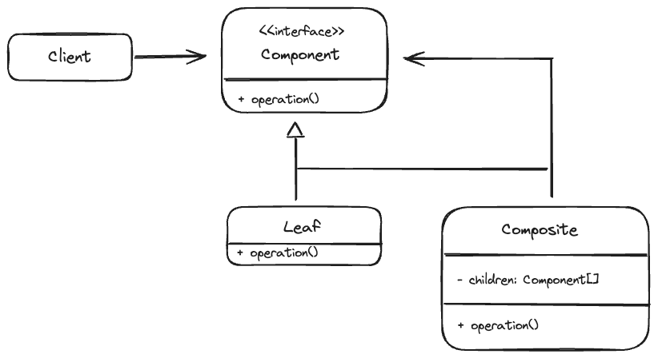
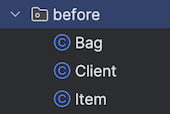
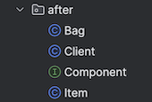

## 컴포지트 패턴이란?
---
Composite 패턴은 객체를 트리 구조로 구성하여 복합객체와 개별객체를 동일한 방법으로 다룰 수 있도록 하는 디자인 패턴이다. 쉽게 말해 강결합되어 있는 객체의 연결을 느슨하게 만들고 재사용성을 강화하기 위해 계층적인 구조로 만드는 설계 기법이다.

<br>
<br>

## 주요 구성 요소 및 구조
---


위 UML 다이어그램을 살펴보면 `Client` 클래스가 `Leaf`와 `Composite` 클래스를 직접 참조하지 않고 공통 인터페이스인 `Component`를 참조한다. 

- Component(구성 요소)
  - `Leaf`와 `Composite`가 구현해야 하는 공통 인터페이스로, Leaf와 Composite는 모두 `Component`라는 같은 타입으로 다룬다.

- Composite(복합 객체)
  - `Composite` 객체는 `Leaf` 객체를 포함할 수도 있고 `Leaf` 객체를 가진 또다른 `Composite` 객체를 가질 수도 있다. 이를 복합적으로 담을 수 있다해서 복합 객체라고 한다.

- Leaf(노드, 개별 객체)
  - 하위 객체가 존재하지 않는 개별 객체이다. 즉 `Leaf`는 자식이 없는 구체 클래스이다. 

이를 대표하는 예시가 바로 `Directory-File` 구조이다. 
컴포지트의 의도는 이처럼 트리 구조로 작성하여, `전체-부분(Whole-Part)` 관계를 효율적으로 정의하는 것이다.

<br>
<br>

## 컴포지트 패턴 적용 전
---
<figure align="center">

<figcaption>패턴 적용 전 디렉토리 구조</figcaption>
</figure>

### Item
```java
public class Item {

  private String name;

  private int price;

  public Item(String name, int price) {
    this.name = name;
    this.price = price;
  }

  public int getPrice() {
    return this.price;
  }
}
```

### Bag
```java
public class Bag {

  private List<Item> items = new ArrayList<>();

  public void add(Item item) {
    items.add(item);
  }

  public List<Item> getItems() {
    return items;
  }
}
```

### Client
```java
public class Client {
  // Client는 클래스를 사용하는 클래스로 상대적인 개념이다. 
  public static void main(String[] args) {
    Item doranBlade = new Item("도란검", 450);
    Item healPotion = new Item("체력 물약", 50);

    Bag bag = new Bag();
    bag.add(doranBlade);
    bag.add(healPotion);

    Client client = new Client();
    client.printPrice(doranBlade);
    client.printPrice(bag);
  }

  private void printPrice(Item item) {
    System.out.println(item.getPrice());
  }

  private void printPrice(Bag bag) {
    int sum = bag.getItems().stream().mapToInt(Item::getPrice).sum();
    System.out.println(sum);
  }
}
```
해당 코드는 클라이언트가 Item과 Bag 클래스를 출력하는 코드이다.  

기존 코드에서는 `Client` 클래스가 개별 Item과 Bag에 들어있는 모든 Item을 출력하기 위해 직접 Item, Bag 클래스를 참조하는 방식을 사용한다. 

만약 새로운 클래스인 Character를 추가한다면 클라이언트 코드를 다시 변경해야 되는 번거로움이 발생한다. 

컴포지트 패턴은 객체지향 프로그래밍의 특징인 다형성을 활용하여 같은 Component를 구현한 Composite, leaf를 참조할 수 있도록 한다. 

<br>
<br>

## 컴포지트 패턴 적용 후
---
<figure align="center">

<figcaption>패턴 적용 후 디렉토리 구조</figcaption>
</figure>

### Component
```java
public interface Component {

  int getPrice();

}
```

### Item
```java
public class Item implements Component {

  private String name;

  private int price;

  public Item(String name, int price) {
    this.name = name;
    this.price = price;
  }

  @Override
  public int getPrice() {
    return this.price;
  }
}
```

### Bag
```java
public class Bag implements Component {
  // 컴포지트 패턴은 Leaf를 직접 참조하지 않는다. 
  // Composite 객체에서도 마찬가지로 Component를 참조한다.
  private List<Component> components = new ArrayList<>();

  public void add(Component component) {
      components.add(component);
  }

  public List<Component> getComponents() {
    return components;
  }

  // 가격을 구하는 메서드를 Composite에서 구현하여 OCP 원칙을 준수(인터페이스 강제 구현 역할)
  @Override
  public int getPrice() {
    return components.stream().mapToInt(Component::getPrice).sum();
  }
}
```

### Client
```java
public class Client {

  public static void main(String[] args) {
    Item doranBlade = new Item("도란검", 450);
    Item healPotion = new Item("체력 물약", 50);

    Bag bag = new Bag();
    bag.add(doranBlade);
    bag.add(healPotion);

    Client client = new Client();
    client.printPrice(doranBlade);
    client.printPrice(bag);
  }

  private void printPrice(Component component) {
    System.out.println(component.getPrice());
  }
}
```
공통 인터페이스인 Component 클래스를 만들고 Bag과 Item이 지원해야 하는 공통 기능(operation)인 getPrice()를 정의하였다. 

Client 클래스가 이 Component를 통해 Leaf와 Bag을 참조하도록 하는 것이 Composite 패턴이다.

<br>
<br>

## 장단점
- 장점
  - 복잡한 트리 구조를 편리하게 사용할 수 있다.
  - 다형성과 재귀를 사용할 수 있다.
  - 클라이언트 코드를 변경하지 않고 새로운 엘리먼트 타입(Leaf, Composite)을 추가할 수 있다(OCP 원칙). 

- 단점
  - 트리를 만들어야 하기 때문에(공통된 인터페이스를 정의해야 하기 때문에) 지나치게 일반화 해야 하는 경우도 생길 수 있다.
  - 트리의 깊이(depth)가 깊어질 수록 디버깅에 어려움이 생긴다.

<br>
<br>

## 실무에서 쓰이는 컴포지트 패턴

### Swing 라이브러리
자바에서 GUI 애플리케이션을 만들기 위한 라이브러리로 다양한 컴포넌트(버튼, 텍스트 필드)을 제공하고 이들을 계층적으로 배치할 수 있다.

```java
public class SwingExample {

  public static void main(String[] args) {
    // JFrame, JTextField, JButton 모두 Component를 상속받고 있다.
    JFrame frame = new JFrame();

    JTextField textField = new JTextField();
    textField.setBounds(200, 200, 200, 40);
    frame.add(textField);

    JButton button = new JButton("click");
    button.setBounds(200, 100, 60, 40);
    button.addActionListener(e -> textField.setText("Hello Swing"));
    frame.add(button);

    frame.setSize(600, 400);
    frame.setLayout(null);
    frame.setVisible(true);
  }
}
```
자바의 Swing 라이브러리는 추상 클래스로 컴포지트 패턴을 사용하였다. 

<br>
<br>

## 인터페이스 vs 추상 클래스
---
Swing 라이브러리의 예시로 보았듯이 컴포지트 패턴은 두 접근 방식 모두 사용 가능하다. 

그렇다면 인터페이스와 추상 클래스 중 어떤 것을 사용해야 할까?

- 인터페이스를 사용하는 경우
  - 인터페이스는 다중상속을 지원하고 구현을 강제한다. 또 구현이 없는 메서드 선언만 포함하므로, 각 구현 클래스는 자유롭게 구현할 수 있어 유연한 설계가 필요할 때 인터페이스를 사용한다. 

- 추상클래스를 사용하는 경우
  - 공통 기능의 기본 구현이 필요한 상황에 사용한다. 또한 상태를 저장할 수 있어 일관된 클래스 계층 구조를 유지할 수 있다. 즉 공통된 기능을 한 곳에 모아두고, 필요한 경우만 하위 클래스에서 재정의 할 수 있다. 

<br>
<br>

## 정리
메뉴나 디렉토리 처럼 트리 구조를 갖는 코드를 추상적으로 다룰 수 있다는 점에서 유용한 패턴이다. 하지만 단점으로 지적된 부분처럼 어울리지 않는 코드에 억지로 패턴을 적용하려 한다면 역효과가 날 수 있다. 

너무 특정한 디자인 패턴에 종속적으로 코드를 작성하고 있는 것은 아닌지 의심을 해보고 다른 시각에서 다양하게 Problem Solving을 하려는 노력이 중요하다. 

<br>
<br>

## 참고
> -코딩으로 학습하는 GoF의 디자인 패턴 - 백기선 강사님  
> -헤드퍼스트 디자인패턴(개정판)
