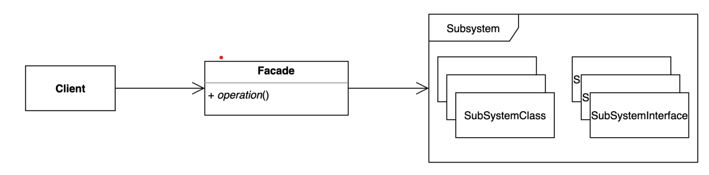
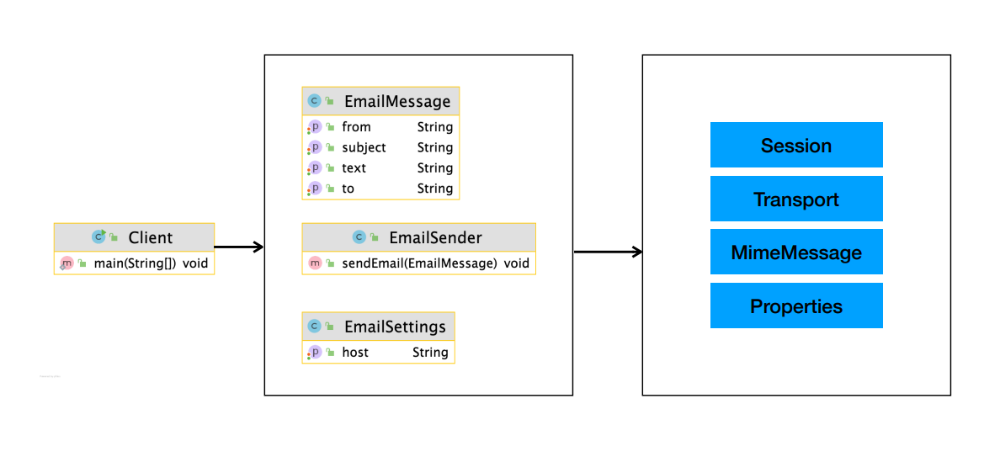

# 퍼사드 패턴

## 퍼사드의 사전적 의미
파사드(프랑스어: Façade)는 건물의 출입구로 이용되는 정면 외벽 부분을 가리키는 말이다.

출처:https://ko.wikipedia.org/wiki/%ED%8C%8C%EC%82%AC%EB%93%9C


## 퍼사드패턴이란?
- 복잡한 서브 시스템 의존성을 최소화하여 사용자가 보다 쉽게 접근할 수 있도록 해준다.
- 클라이언트가 사용해야 하는 복잡한 서브 시스템 의존성을 간단한 인터페이스로 추상화 할
  수 있다.
## 퍼사드패턴 구현방법



- 퍼사드 클래스(Facade Class): 복잡한 시스템에 대한 간단한 인터페이스를 제공하는 클래스.
- 서브 시스템 클래스(Subsystem Classes): 실제 작업을 수행하는 여러 클래스.

<details>
<summary>적용전 코드 보기</summary>

### Client
```java
import javax.mail.Message;
import javax.mail.MessagingException;
import javax.mail.Session;
import javax.mail.Transport;
import javax.mail.internet.InternetAddress;
import javax.mail.internet.MimeMessage;
import java.util.Properties;

public class Client {

    public static void main(String[] args) {
        String to = "keesun@whiteship.me";
        String from = "whiteship@whiteship.me";
        String host = "127.0.0.1";

        Properties properties = System.getProperties();
        properties.setProperty("mail.smtp.host", host);

        Session session = Session.getDefaultInstance(properties);

        try {
            MimeMessage message = new MimeMessage(session);
            message.setFrom(new InternetAddress(from));
            message.addRecipient(Message.RecipientType.TO, new InternetAddress(to));
            message.setSubject("Test Mail from Java Program");
            message.setText("message");

            Transport.send(message);
        } catch (MessagingException e) {
            e.printStackTrace();
        }
    }
}
```
</details>

<details>
<summary>적용후 코드 보기</summary>

### Client
```java
public class Client {

    public static void main(String[] args) {
        EmailSettings emailSettings = new EmailSettings();
        emailSettings.setHost("127.0.0.1");

        EmailSender emailSender = new EmailSender(emailSettings);

        EmailMessage emailMessage = new EmailMessage();
        emailMessage.setFrom("keesun");
        emailMessage.setTo("whiteship");
        emailMessage.setCc("일남");
        emailMessage.setSubject("오징어게임");
        emailMessage.setText("밖은 더 지옥이더라고..");

        emailSender.sendEmail(emailMessage);
    }
}
```

### EmailMessage

```java
public class EmailMessage {

    private String from;

    private String to;
    private String cc;
    private String bcc;

    private String subject;

    private String text;

    public String getFrom() {
        return from;
    }

    public void setFrom(String from) {
        this.from = from;
    }

    public String getTo() {
        return to;
    }

    public void setTo(String to) {
        this.to = to;
    }

    public String getSubject() {
        return subject;
    }

    public void setSubject(String subject) {
        this.subject = subject;
    }

    public String getText() {
        return text;
    }

    public void setText(String text) {
        this.text = text;
    }

    public String getCc() {
        return cc;
    }

    public void setCc(String cc) {
        this.cc = cc;
    }

    public String getBcc() {
        return bcc;
    }

    public void setBcc(String bcc) {
        this.bcc = bcc;
    }
}
```

### EmailSender
```java
import javax.mail.Message;
import javax.mail.MessagingException;
import javax.mail.Session;
import javax.mail.Transport;
import javax.mail.internet.InternetAddress;
import javax.mail.internet.MimeMessage;
import java.util.Properties;

public class EmailSender {

    private EmailSettings emailSettings;

    public EmailSender(EmailSettings emailSettings) {
        this.emailSettings = emailSettings;
    }

    /**
     * 이메일 보내는 메소드
     * @param emailMessage
     */
    public void sendEmail(EmailMessage emailMessage) {
        Properties properties = System.getProperties();
        properties.setProperty("mail.smtp.host", emailSettings.getHost());

        Session session = Session.getDefaultInstance(properties);

        try {
            MimeMessage message = new MimeMessage(session);
            message.setFrom(new InternetAddress(emailMessage.getFrom()));
            message.addRecipient(Message.RecipientType.TO, new InternetAddress(emailMessage.getTo()));
            message.addRecipient(Message.RecipientType.CC, new InternetAddress(emailMessage.getCc()));
            message.setSubject(emailMessage.getSubject());
            message.setText(emailMessage.getText());

            Transport.send(message);
        } catch (MessagingException e) {
            e.printStackTrace();
        }
    }


}
```

### EmailSettings
```java
public class EmailSettings {

    private String host;

    public String getHost() {
        return host;
    }

    public void setHost(String host) {
        this.host = host;
    }
}
```
</details>

## 퍼사드 패턴 사용 시기
- 복잡한 시스템을 단순화하여 사용할 때
- 여러 객체들 간의 상호작용을 단순화하여 클라이언트 코드가 간단해지게 할 때
- 서브 시스템의 변경이 클라이언트 코드에 미치는 영향을 줄이고자 할 때

## 퍼사드 패턴 장단점
- 장점
1. 서브 시스템에 대한 의존성을 한곳으로 모을 수 있다.
2. 클라이언트는 서브 시스템의 세부 사항을 몰라도 되기 때문에, 서브 시스템의 변경이 클라이언트에 미치는 영향을 줄일 수 있다.

- 단점
1. 퍼사드 클래스가 서브 시스템에 대한 모든 의존성을 가지게 된다.
2. 퍼사드 클래스가 너무 많은 기능을 포함하게 되면, 퍼사드 클래스 자체가 복잡해질 수 있다.

## 퍼사드 패턴 사용 사례
스프링

- Spring MVC
- 스프링이 제공하는 대부분의 기술 독립적인 인터페이스와 그 구현체

```java
import org.springframework.jdbc.support.JdbcTransactionManager;
import org.springframework.mail.MailSender;
import org.springframework.mail.javamail.JavaMailSenderImpl;
import org.springframework.transaction.PlatformTransactionManager;

public class FacadeInSpring {

    public static void main(String[] args) {
        MailSender mailSender = new JavaMailSenderImpl();

        PlatformTransactionManager platformTransactionManager = new JdbcTransactionManager();
    }
}
```


