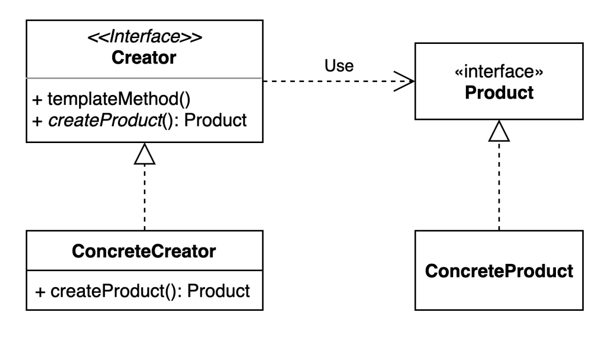
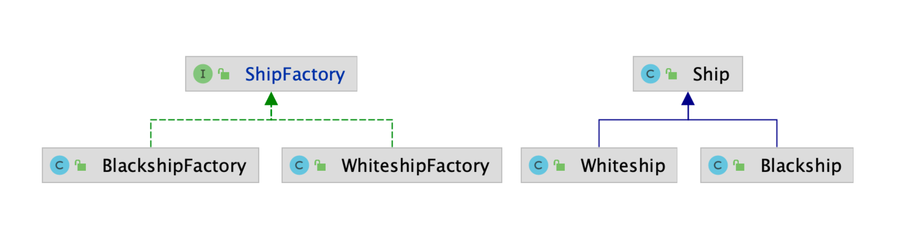
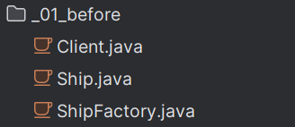
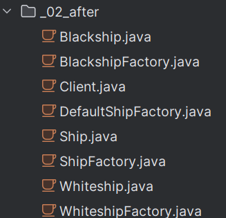

# 팩토리 메서드 패턴

## 팩토리 메서드 패턴이란?
- 구체적으로 어떤 인스턴스를 만들지는 서브클래스가 정한다.

- 다양한 구현체 (Product)가 있고, 그중에서 특정한 구현체를 만들 수 있는 다양한 팩토리(Creator)를 제공할 수 있다.
  

- 객체 생성의 인터페이스를 정의하지만, 클래스의 인스턴스를 만들기 위한 구체적인 클래스를 결정하는 것을 서브클래스에서 처리하도록 하는 디자인 패턴.
- 객체 생성 로직을 "캡슐화"하여 코드의 유연성과 확장성을 높입니다.

언제사용하나? 
- 객체 생성 로직이 복잡하거나 변경될 가능성이 높은 경우에 적합하다.


### 팩토리 메서드 패턴 장단점

1. 장점

  - 생성자(Creator)와 구현 객체(concrete product)의 강한 결합을 피할 수 있다.
  
  - 팩토리 메서드를 통해 객체의 생성 후 공통으로 할 일을 수행하도록 지정해줄 수 있다.

  - 캡슐화, 추상화를 통해 생성되는 객체의 구체적인 타입을 감출 수 있다.

  - 개방/폐쇄 원칙(OCP) 준수 : 기존 코드를 수정하지 않고 새로운 유형의 제품 인스턴스를 프로그램에 도입할 수 있어 원칙을 만족 

  - 단일 책임 원칙 준수(SRP) : 객체 생성 코드를 한 곳 (패키지, 클래스 등)으로 이동하여 코드를 유지보수하기 쉽게 할수 있으므로 원칙을 만족

  - 새로운 제품 클래스를 추가하더라도 기존 코드를 수정할 필요가 없습니다(확장성).
  
  - 생성할 객체의 클래스를 서브클래스에서 정의하므로, 객체 생성 로직을 쉽게 변경할 수 있습니다(유연성).

  - 공통 인터페이스를 사용하여 코드의 재사용성을 높입니다(코드 재사용성).

2. 단점
  - 각 제품 구현체마다 팩토리 객체들을 모두 구현해주어야 하기 때문에, 구현체가 늘어날때 마다 팩토리 클래스가 증가하여 서브 클래스 수가 폭발한다.
  
  - 코드의 복잡성이 증가한다.

  - 객체 생성 과정이 캡슐화되어 있어, 디버깅이 어려울 수 있다.


### 팩토리 메서드 구현 방법
 - 확장에 열려있고 변경에 닫혀있는 구조


###  확장엔 열려있고 변경엔 닫혀있는 객체지향 원칙
  - 객체지향 설계의 기본 원칙 중 하나로, Open/Closed Principle(OCP) 이라고도 한다. 이 원칙은 로버트 C.마틴이 제안한 SOLID 원칙 중 하나이다.
  -  OCP는 소프트웨어 엔티티(클래스, 모듈, 함수 등)는 확장에는 열러(Open) 있어야 하지만, 수정에는 닫혀(Closed) 있어야 한다는 원칙입니다.
1. 확장에 열려 있음(Open for extension):
 - 소프트웨어 엔티티는 새로운 기능을 추가하는 것이 가능해야 합니다.
 - 새로윤 요구 사항이 생길 때 기존의 코드를 변경하지 않고도 기능을 확장할 수 있어야 합니다.
2. 변경에 닫혀 있음(Closed for modification):
 - 기존의 소스 코드는 변경되지 않아야 합니다.
 - 코드의 수정 없이 새로운 동작을 추가할 수 있어야 합니다.

### 최상위 팩토리를 인터페이스로 구성하기
- 최상위 팩토리 클래스는 반드시 추상 클래스로 선언할 필요가 없다.
- Java8 버전 이후 추가된 인터페이스의 default 메서드와 java 9 버전 이후 추가된 private 메서드를 통해 그대로 인터페이스로 구성할 수 있기 때문이다.

## 팩토리 메서드 패턴 적용전 

#### Ship 객체를 만들어 반환하는 메서드를 정의하는 방법



<details>
<summary>적용전 코드 보기</summary>

### Client.java

```java
public class Client {

    public static void main(String[] args) {
        Ship whiteship = ShipFactory.orderShip("Whiteship", "keesun@mail.com");
        System.out.println(whiteship);

        Ship blackship = ShipFactory.orderShip("Blackship", "keesun@mail.com");
        System.out.println(blackship);
    }
    
}
```
### Ship.java
```java
public class Ship {

    private String name;

    private String color;

    private String logo;

    public String getName() {
        return name;
    }

    public void setName(String name) {
        this.name = name;
    }

    public String getColor() {
        return color;
    }

    public void setColor(String color) {
        this.color = color;
    }

    public String getLogo() {
        return logo;
    }

    public void setLogo(String logo) {
        this.logo = logo;
    }

    @Override
    public String toString() {
        return "Ship{" +
                "name='" + name + '\'' +
                ", color='" + color + '\'' +
                ", logo='" + logo + '\'' +
                '}';
    }
}
```
### ShipFactory.java

``` java
public class ShipFactory {

    public static Ship orderShip(String name, String email) {
        // validate
        if (name == null || name.isBlank()) {
            throw new IllegalArgumentException("배 이름을 지어주세요.");
        }
        if (email == null || email.isBlank()) {
            throw new IllegalArgumentException("연락처를 남겨주세요.");
        }

        prepareFor(name);

        Ship ship = new Ship();
        ship.setName(name);

        // Customizing for specific name
        if (name.equalsIgnoreCase("whiteship")) {
            ship.setLogo("\uD83D\uDEE5️");
        } else if (name.equalsIgnoreCase("blackship")) {
            ship.setLogo("⚓");
        }

        // coloring
        if (name.equalsIgnoreCase("whiteship")) {
            ship.setColor("whiteship");
        } else if (name.equalsIgnoreCase("blackship")) {
            ship.setColor("black");
        }

        // notify
        sendEmailTo(email, ship);

        return ship;
    }

    private static void prepareFor(String name) {
        System.out.println(name + " 만들 준비 중");
    }

    private static void sendEmailTo(String email, Ship ship) {
        System.out.println(ship.getName() + " 다 만들었습니다.");
    }

}
```
- 위의 방법으로 코드를 작성하게 되면 다른 종류의 선박이 추가가 될때마다 분기문이 선형적으로 늘어나 복잡해 질 것이다.
  
- 나중에 Ship 클래스의 구성이 변하게 된다면 코드를 통째로 바꿔야 하는 문제점이 생긴다.
</details>


## 팩토리 메서드 패턴 적용후
- 먼저 ShipFactory 클래스를 추상 클래스로 변환하고 Ship 인스턴스 생성을 책임지는 createShip() 메서드를 추상 메서드로 추상화 시킨다.
- 각 선박 종류에 맞게 ShipFactory 클래스를 상속하는 서브 팩토리 클래스들을 만들고 createShip() 추상 메서드를 각 객체 특징에 맞게 재정의 하도록 한다.
- 즉 orderShip() 메서드의 공통 코드는 냅두고 Ship 인스턴스를 만드는 작업 코드는 서브 클래스가 결정하도록 하는 것이다
<br></br>


<details>
<summary>적용후 코드 보기</summary>

### Blackship.java
``` java
public class Blackship extends Ship {

    public Blackship() {
        setName("blackship");
        setColor("black");
        setLogo("⚓");
    }
}
```
### BlackshipFactory.java
``` java
public class BlackshipFactory extends DefaultShipFactory {
    @Override
    public Ship createShip() {
        return new Blackship();
    }
}
```

### Client.java
- Client 클래스는 구체적인 Ship 객체를 생성하는 역할을 ShipFactory 인터페이스를 구현한 팩토리 클래스에 위임합니다.
- 이렇게 함으로써 수정에는 닫혀있고 확장에는 열려있게 된다.
- 만약 BlueShip 이라는 새로운 종류의 선박 제품을 추가한다라고 가정하면, 간단하게 제품 객체와 공장 객체를 각각 정의하고 상속 시키기만 하면 기존에 작성 했던 코드 수정없이 확장된다
``` java
public class Client {

    public static void main(String[] args) {
        Client client = new Client();
        client.print(new WhiteshipFactory(), "whiteship", "keesun@mail.com");
        client.print(new BlackshipFactory(), "blackship", "keesun@mail.com");
    }

    private void print(ShipFactory shipFactory, String name, String email) {
        System.out.println(shipFactory.orderShip(name, email));
    }

}
```

### DefaultShipFactory.java
``` java
public abstract class DefaultShipFactory implements ShipFactory {

    @Override
    public void sendEmailTo(String email, Ship ship) {
        System.out.println(ship.getName() + " 다 만들었습니다.");
    }

}
```

### Ship.java
``` java
public class Ship {

    private String name;

    private String color;

    private String logo;

    private Wheel wheel;

    private Anchor anchor;

    public String getName() {
        return name;
    }

    public void setName(String name) {
        this.name = name;
    }

    public String getColor() {
        return color;
    }

    public void setColor(String color) {
        this.color = color;
    }

    public String getLogo() {
        return logo;
    }

    public void setLogo(String logo) {
        this.logo = logo;
    }

    @Override
    public String toString() {
        return "Ship{" +
                "name='" + name + '\'' +
                ", color='" + color + '\'' +
                ", logo='" + logo + '\'' +
                '}';
    }

    public Wheel getWheel() {
        return wheel;
    }

    public void setWheel(Wheel wheel) {
        this.wheel = wheel;
    }

    public Anchor getAnchor() {
        return anchor;
    }

    public void setAnchor(Anchor anchor) {
        this.anchor = anchor;
    }
}
```
### ShipFactory.java
``` java
public interface ShipFactory {

    default Ship orderShip(String name, String email) {
        validate(name, email);
        prepareFor(name);
        Ship ship = createShip();
        sendEmailTo(email, ship);
        return ship;
    }

    void sendEmailTo(String email, Ship ship);

    Ship createShip();

    private void validate(String name, String email) {
        if (name == null || name.isBlank()) {
            throw new IllegalArgumentException("배 이름을 지어주세요.");
        }
        if (email == null || email.isBlank()) {
            throw new IllegalArgumentException("연락처를 남겨주세요.");
        }
    }

    private void prepareFor(String name) {
        System.out.println(name + " 만들 준비 중");
    }

}
```

### Whiteship.java
``` java
public class Whiteship extends Ship {

    public Whiteship() {
        setName("whiteship");
        setLogo("\uD83D\uDEE5️");
        setColor("white");
    }
}
```

### WhiteshipFactory.java
``` java
public class WhiteshipFactory extends DefaultShipFactory {

    @Override
    public Ship createShip() {
        return new Whiteship();
    }
}
```
### 결론
`Client` 클래스는 객체 생성 책임을 `ShipFactory` 인터페이스를 구현한 팩토리 클래스에 위임하여, 구체적인 `Ship` 클래스에 의존하지 않게 됩니다. 이렇게 하면 클라이언트 코드와 객체 생성 로직이 분리되어 유지보수성과 확장성이 향상됩니다.
</details>

## 자바와 스프링에서 찾아보는 팩토리패턴
### 단순한 팩토리 패턴
java.util.Calendar 의 getInstance()
``` java
import java.util.Calendar;
import java.util.Locale;

public class CalendarExample {

    public static void main(String[] args) {
        System.out.println(Calendar.getInstance().getClass());
        System.out.println(Calendar.getInstance(Locale.forLanguageTag("th-TH-x-lvariant-TH")).getClass());
        System.out.println(Calendar.getInstance(Locale.forLanguageTag("ja-JP-x-lvariant-JP")).getClass());
    }
}
```

### Spring Framework의 BeanFactory
``` java
import org.springframework.beans.factory.BeanFactory;
import org.springframework.context.annotation.AnnotationConfigApplicationContext;
import org.springframework.context.support.ClassPathXmlApplicationContext;

public class SpringBeanFactoryExample {

    public static void main(String[] args) {
        BeanFactory xmlFactory = new ClassPathXmlApplicationContext("config.xml");
        String hello = xmlFactory.getBean("hello", String.class);
        System.out.println(hello);

        BeanFactory javaFactory = new AnnotationConfigApplicationContext(Config.class);
        String hi = javaFactory.getBean("hello", String.class);
        System.out.println(hi);
    }
}
```


