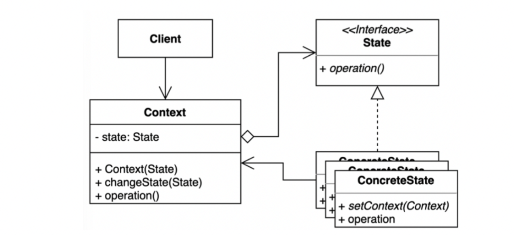

# 상태 패턴 (State 패턴)
<div>

</div>
*출처: https://refactoring.guru/ko/design-patterns/state*


## 정의
객체 내부 상태 변경에 따라 객체의 행동이 달라지는 패턴.
- 상태에 특화된 행동들을 분리해 낼 수 있으며, 새로운 행동을 추가하더라도 다른 행동에 영향을 주지 않는다.
- 특정한 상태에 따라 행동이 달라지는 객체들을 위한 패턴이다.
## 구성요소
<div>

</div>

- `Context`: 상태 변경을 관리하는 메서드, 고유한 정보들을 가지고 있는 클래스이다.
- `State`: `Context`가 변경될 수 있는 상태들을 공통된 인터페이스를 만든것이다.

## 상태 패턴 적용 전
<details>
<summary>코드보기</summary>

### Client
```java
public class Client {

    public static void main(String[] args) {
        Student student = new Student("whiteShip");
        OlineCourse olineCourse = new OnlineCourse();
        
        Student keesun = new Student("keesun");
        keesun.addPrivateCourse(onlineCourse);
        
        olineCourse.addStudent(student);
        olineCourse.changeState(OlineCourse.stae.PRIVATE);
        
        olineCourse.addStudent(keesun);
        
        onlineCourse.addReview("hello", student);
        
        System.out.println(olineCourse.getState());
        System.out.println(olineCourse.getStudents());
        System.out.println(olineCourse.getReviews());
    }
}

```

### OlineCourse
```java
public class OnlineCourse {
    public enum State {
        DRAFT, PUBLISHED, PRIVATE
    }
    
    private State state = State.DRAFT;
    
    private List<String> revies = new ArrayListe<>();
    
    private List<Student> students = new ArrayList<>();
    
    public void addReview(String review, Student student) {
        if(this.state == State.PUBLISHED) {
            this.reviews.add(review);
        } else if (this.state == State.PRIVATE && this.students.contains(student)) {
            this.revies.add(review);
        } else {
            throw new UnsupportedOperationException("드래프트 상태에서는 리뷰를 작성할 수 없습니다.");
        }
    }
}
```
</details>

- 코드를 읽기가 어렵고 한눈에 알아보기가 어렵다
- 상황에 따라 상태가 바뀔때  상태 패턴을 사용하기 적합하다

## 상태 패턴 적용 후
<details>
<summary>코드보기</summary>

### OlineCourse
```java
public class OnlineCourse {
    private State state;
    
    private List<Student> student;
    
    private List<String> reviews;
    
    public void addStudent(Student student) {
        this.state.addStudent(student);
    }
    
    public void addReview(String review, Student student) {
        this.students.add(student);
    }
}

```

### Client
```java
public  class Client {

    public static void main(String[] args) {
        OnlineCourse onlineCourse = new OnlineCourse();
        Student student = new Studnet("whiteship");
    }
}
```


### Student
```java
import java.util.HashSet;

public class Student {

    private String name;

    public Student(String name) {
        this.name = name;
    }

    private set<OnlineCourse> onlineCourse = new HashSet<>();
    
    public boolean isAvailable(OnlineCourse onlineCourse) {
        return onlineCourse.cotains(onlineCourse);
    }
    
    public void addPrivate(OnlineCourse onlineCourse) {
        this.onlineCourse.add(onlineCourse);
    }
}
```
### State
```java
public interface State {
    void addReview(String review, Student student);
    
    void addStudent(Student student);
}
```

### Draft
```java
public class Draft implements state {
    private OnlineCourse onlineCourse;
    
    @Override
    public void addReview(STring review, Student student){
        throw new UnsupportedOperationException("드래프트 상태에서는 리뷰를 작성할 수 없습니다.");
    }
    
    @Override
    public void addStudent(Student student) {
        this.onlineCourser.getStudnets().add(student);
        if(this.onlineCourse.getStudents().size() > 1){
            this.onlineCourse.changeState(new Private(this.onlineCourse));
        }
    }
}
```
- `context`를 가지고 있어야 한다.
- 이 예제에서는 `OnlineCourse`가 `context`에 해당한다.


### Private
```java
public class Private implements State {
    private OnlineCourse onlineCourse;
    
    public Private(OnlineCourse onlineCourse) {
        this.onlineCourse = onlineCourse;
    }
    
    @Override
    public void addReview(String review, Student student) {
        if (this.onlineCourse.getStudents().contains(student)) {
            this.onlineCourse.getReviews().add(review);
        } else {
            throw new UnsupportedOperationException("프라이빗 코스를 수강하는 학생만 리뷰를 남길 수 있습니다..");
        }
    }
    
    @Override
    public void addStudent(Student student) {
        if(student.isAvailable(this.onlineCourse)) {
            this.onlineCourse.addStudent(student);
        } else {
            throw new UnsupportedOperationException("프라이빗 코스를 수강할 수 없습니다."); 
        }
    }
}
```

### published
```java
public class published implements State {
    
    private OnlineCourse onlineCourse;
    
    public Published(OnlineCourse onlineCourse) {
        this.onlineCourse = onlineCourse;
    }
    
    @Override
    public void addReview(String review, Student student) {
        this.onlineCourse.getReviews().add(review);
    }
    @Override
    public void addStudent(Student student) {
        this.onlineCourse.getStudents().add(student);
    }
}

```
</details>

- 한 곳에 뭉쳐 있던 코드들을 상태에 따라 `draft`, `published`, `private`로 적절하게 분산 시켜 
- 코드를 읽을때 부담이 없다.
- 이해하기가 쉬워진다.

## 상태 패턴의 장점, 단점

### 장점
- 상태에 따른 동작을 개별 클래스로 옮겨서 관리할 수 있다.
- 기존의 특정 상태에 따른 동작을 변경하지 않고 새로운 상태에 다른 동작을 추가할 수 있다.
- 코드 복잡도를 줄일 수 있다.

### 단점
- 복잡도가 증가한다.


## 상태패턴 적용 예시
- 상태에 따라 다르게 행동하는 객체가 있을 때, 상태들의 수가 많을 때, 상태별 코드가 자주 변경될 때 사용한다.
- 유사한 상태들에 중복 코드와 상태에 따른 조건문이 많을 때 사용한다.