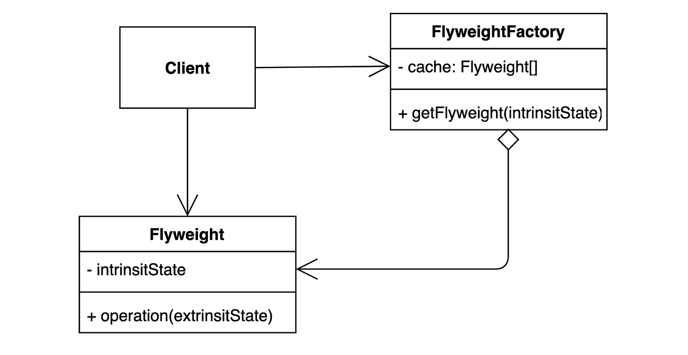

# 플라이웨이트 패턴
<div>

</div>

*출처: https://refactoring.guru/ko/design-patterns/flyweight*

## 정의
객체를 가볍게 만들어 메모리 사용을 줄이는 패턴.
- 자주 변하는 것과 변하지 않는 것을 분리하는 패턴이다.
- `extrinsit` (자주 변하는 속성, 외적인 속성, 비본질적인 속성)과 `intrinsit`(변하지 않는 속성, 내적인 속성, 본질적인)을 분리하고 재사용하여 메모리 사용을 줄일 수 있다.

## 구성요소
<div>

</div>

## 플라이웨이트 패턴 적용 전

<details>
<summary>코드보기</summary>

### Client
```java
public class Client {

    public static void main(String[] args) {
        Character c1 = new Character('h',"white","Nanum",12);
        Character c2 = new Character('e',"yellow","Nanum",12);
        Character c3 = new Character('l',"blue","Nanum",12);
        Character c4 = new Character('l',"red","Nanum",12);
        Character c5 = new Character('o',"black","Nanum",12);
        
    }
}
```

### Character
```java
public class Character {
    private char value;
    private String color;
    private String fontFamily;
    private int fontSize;
    
    public Character(char value, String color, String fontFamily, int fontSize) {
        this.value = value;
        this.color = color;
        this.fontFamily = fontFamily;
        this.fontSize = fontSize;
    }
}
```

</details>

## 문제점
- 글자가 많아지면 메모리양이 많아져서 성능의 영향을 끼친다

## 플라이 웨이트 패턴 적용 후

- 자주 사용한다? 는 주관적이기 때문에 코드를 작성하는 사람이 잘 이해하고 상황에 맞게 적용해야한다.
- 여기선 fontFamily,fontSize를 묶어서 사용하겠다.

<details>
<summary>코드 보기</summary>


### Font
```java
public final class Font {
    final String family;

    final int size;
    
    public Font(String family, int size) {
        this.family = family;
        this.size = size;
    }
    public String getFamily() {
        return family;
    }
    public int getSize() {
        return size;
    }
    
}

```
- 플라이 웨이트에 해당하는 인스턴스는 `immutable(불변)`해야한다. 
- 값이 변경되면 다른 곳에도 영향을 주기 때문에
- `immutable(불변)`하게 하려면 `final`을 사용하면 된다.

### Character
```java
import java.awt.Font;

public class Character {

    private char value;

    private String color;

    private Font font;

    public Character(char value, String color, Font font){
        this.value = value;
        this.color = color;
        this.font = font;
    }
}
```
### FontFactory
- 플라이웨이트 팩토리
- `font`라는 플라이웨이트 인스턴스를 접근할 수 있는, 캐싱해두는 중요한 역할을 한다.

```java
public class FontFactory {
    private  Map<String, Font> cache = new HashMap<>();
    
    public Font getFont(String font) {
       if(cache.containsKey(font)) {
           return cache.get(font);
       } else {
           String[] split = font.split(":");
           Font newFont = new Font(split[0], Integer.parseInt(split[1]));
           cache.put(font, newFont);
           return newFont;
       }
    }
}
```
### Client
```java
public class Client {

    public static void main(String[] args) {
        FontFactory fontFactory = new FontFactory();
        Character c1 = new Character('h', "white",fontFactory.getFont("nanum:12"));
        Character c2 = new Character('e', "white",fontFactory.getFont("nanum:12"));
        Character c3 = new Character('l', "white",fontFactory.getFont("nanum:12"));
    }
}

- 또는 -

public class Client {

    public static void main(String[] args) {
        FontFactory fontFactory = new FontFactory();
        Font font =  fontFactory.getFont("nanum:12");
        Character c1 = new Character('h', "white",font);
        Character c2 = new Character('e', "white",font);
        Character c3 = new Character('l', "white",font);
    }
}
```
- 공유하는 인스턴스를 가져와서 사용했기 때문에 메모리 사용량이 적어진다. 
- 성능 개선을 위한 패턴이다.
- 플라이웨이트팩토리 안에서 캐싱하고 있기 때문에 여러번 호출하여도 같은 값이 나온다.
</details>

### 장점
- 애플리케이션에서 사용하는 메모리를 줄일 수 있다.

### 단점
- 코드의 복잡도가 증가한다.


## 자바에서 찾아보는 플라이웨이트 패턴
<details>
<summary>코드보기</summary>

### Integer valueOf
- 자주 사용되는 값들을 캐싱하고 있다.
- -128 ~127의 값들을 캐싱하고 있다.
```java
- 1 -
public static void main(String[] args) {
    Integer i1 = Integer.valueOf(10);
    Integer i2 = Integer.valueOf(10);
    System.out.println(i1.equals(i2));
}

- 2 -
public static void main(String[] args) {
    Integer i1 = Integer.valueOf(10000);
    Integer i2 = Integer.valueOf(10000);
    System.out.println(i1.equals(i2));
}
```
- 1번 코드는 범위 안에 캐싱이 되어서 `true`가 나오지만
- 2번 코드는 범위 밖이기 때문에 `false`가 나온다.
</details>

## 플라이 웨이트 패턴 적용 예시
- 애플리케이션에 의해 생성되는 객체의 수가 많아 저장 비용이 높아질때
- 생성된 객체가 오래도록 메모리에 상주하며 사용되는 횟수가 많을때
- 공통적인 인스턴스를 많이 생성하는 로직이 포함되는 경우
- 임베디드와 같이 메모리를 최소한으로 사용해야하는 경우


## 캐싱
- 데이터, 값을 미리 복사해 놓는 임시 장소를 의미한다.
- 미리 복사 해 놓음으로써 다시 계산하거나, 접근하는 시간을 줄일 수 있어 빠르게 접근 가능
  